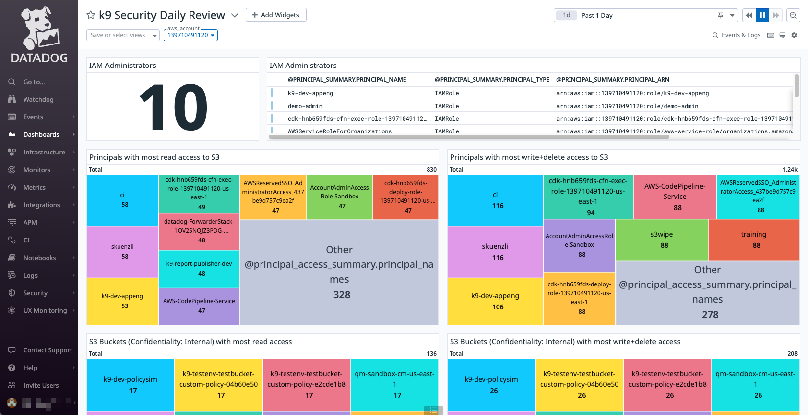

# k9 Security Datadog Integration

This repo contains the k9 Security Datadog integration tools.

These tools help you load the k9 Security csv files into Datadog for viewing in the k9 Security dashboard:



The tools include:

* a log pipeline that parses k9 Security's CSV files into Datadog events
* a (sample) dashboard to perform k9 Security's Daily Reviews

## Log Pipeline
Ingest k9 Security's CSV files into Datadog as log files by configuring the Datadog forwarder to monitor the secure inbox S3 bucket where your k9 reports are delivered.

Then import the log event processing pipeline [k9-reports-latest.pipeline.json](pipelines/k9-reports-latest.pipeline.json).  See the Datadog pipeline API docs for [creating](https://docs.datadoghq.com/api/latest/logs-pipelines/?code-lang=curl#create-a-pipeline) or updating a pipeline.  There's also a curl command to [create a pipeline](#create-the-log-pipeline) in the Development section.

You should now have a `k9-reports latest` log pipeline:


Finally, change the pipeline's host S3 bucket from `CHANGE-TO-YOUR-SECURE-INBOX`.

Now the next time k9 delivers reports (or you drop a slightly modified file into the latest directory), Datadog will parse the files into native Datadog events.  You can then search and visualize those events.

## k9 Daily Review Dashboard
The k9 Security Daily Review dashboard ([k9security-daily-review.json](dashboards/k9security-daily-review.json)) helps you execute the [k9 IAM access review processes](https://www.k9security.io/docs/katas/):
 
* Review IAM administrators
* Review principals access for excessive permissions
* Review access to critical data sources and keys
* Review credentials

You can use this dashboard directly.  Or you can use the queries and visualizations in your own dashboards.

See the Datadog dashboard docs for details on how to [import the dashboard json into Datadog](https://docs.datadoghq.com/dashboards/#copy-import-or-export-dashboard-json).

## Development
This section contains some commands useful during integration development.

### Create the log pipeline

```shell
curl -X POST "https://api.datadoghq.com/api/v1/logs/config/pipelines" \
    -H "Accept: application/json" \
    -H "Content-Type: application/json" \
    -H "DD-API-KEY: ${DD_API_KEY}" \
    -H "DD-APPLICATION-KEY: ${DD_APP_KEY}" \
    --data "@pipelines/k9-reports-latest.pipeline.json"
```

### Get the log pipeline

```shell
export DD_PIPELINE_ID="-D4J40aCQLefllk8y9Rh9w" # 'k9-reports - latest' pipeline 
curl -X GET "https://api.datadoghq.com/api/v1/logs/config/pipelines/${DD_PIPELINE_ID}" \
     -H "Accept: application/json" -H "DD-API-KEY: ${DD_API_KEY}" -H "DD-APPLICATION-KEY: ${DD_APP_KEY}" \
     | jq '.' | tee pipelines/k9-reports-latest.pipeline.json
```